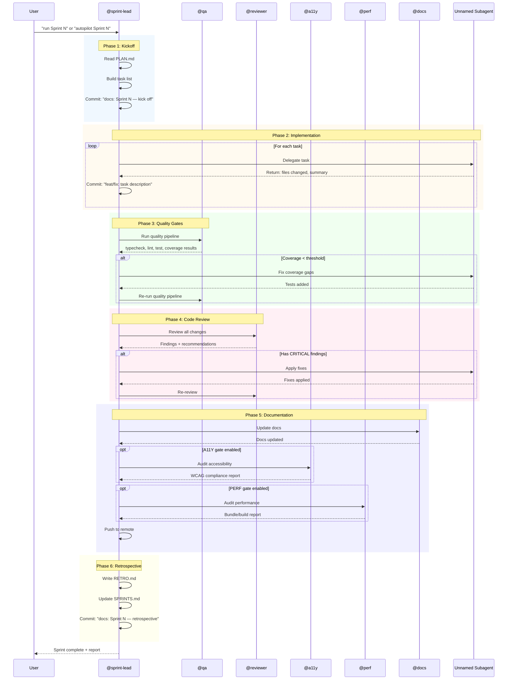
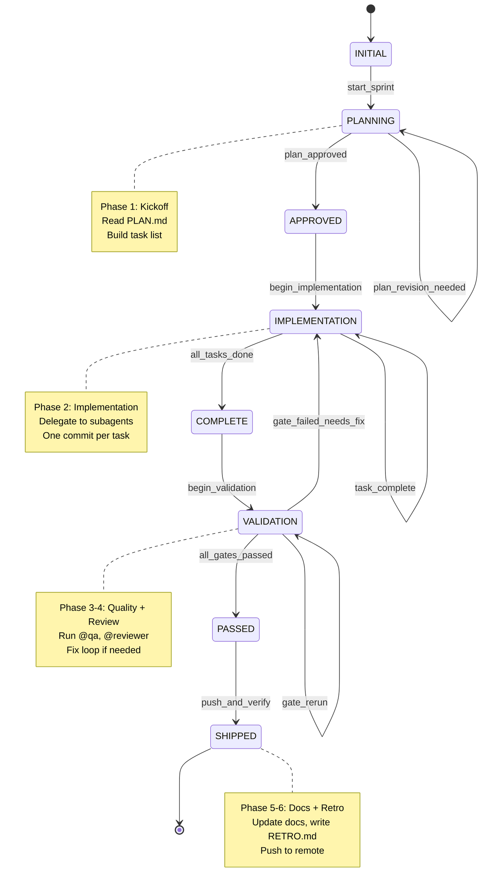
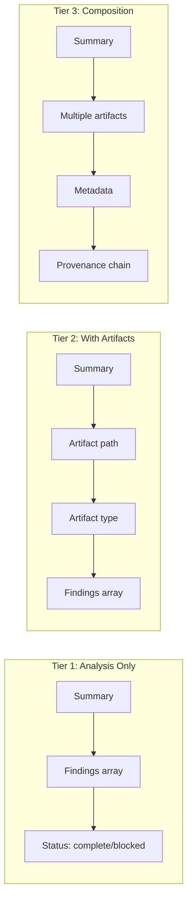
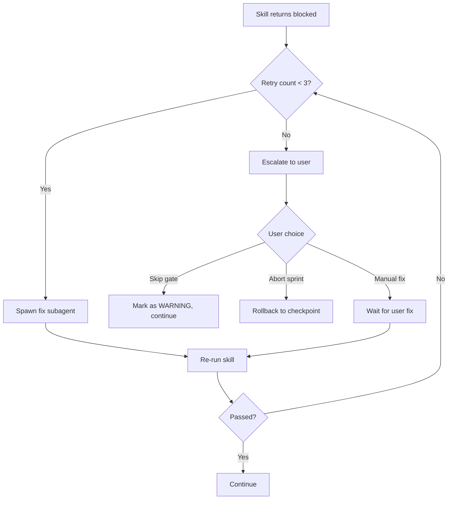

# Skill Execution Flow

How agent-homebase skills orchestrate work. This document shows execution sequences, dependencies, and the FSM state machine.

---

## Skill Inventory

| Skill | Role | Invokes | Invoked By |
|-------|------|---------|------------|
| **@planner** | Scope requirements, draft sprint plans | @researcher | User, @sprint-lead |
| **@sprint-lead** | Orchestrate sprint execution end-to-end | @qa, @a11y, @perf, @reviewer, @docs, unnamed subagents | User |
| **@pm** | Validate features using 5-test echo-chamber | — | @planner |
| **@qa** | Run quality pipeline (test/lint/typecheck) | — | @sprint-lead |
| **@reviewer** | Code review for patterns, security | — | @sprint-lead |
| **@architect** | Design approaches, ADRs | @researcher | User, @planner |
| **@researcher** | Surface external patterns with citations | — | @planner, @architect |
| **@bug** | Capture bugs into structured backlog | — | User, @qa |
| **@docs** | Maintain documentation post-sprint | — | @sprint-lead |
| **@a11y** | WCAG 2.1 AA accessibility audits | — | @sprint-lead |
| **@perf** | Bundle size, build time, dependency audits | — | @sprint-lead |

---

## Sprint Execution Flow



---

## FSM State Machine

The sprint-lead follows a 10-state finite state machine:



### State Descriptions

| State | Description | Exit Conditions |
|-------|-------------|-----------------|
| INITIAL | Sprint not started | `start_sprint` → PLANNING |
| PLANNING | Reading PLAN.md, building task list | `plan_approved` → APPROVED |
| APPROVED | Plan validated, ready to implement | `begin_implementation` → IMPLEMENTATION |
| IMPLEMENTATION | Tasks being executed by subagents | `all_tasks_done` → COMPLETE |
| COMPLETE | All tasks finished, ready for validation | `begin_validation` → VALIDATION |
| VALIDATION | Running quality gates and code review | `all_gates_passed` → PASSED, `gate_failed` → IMPLEMENTATION |
| PASSED | All gates passed, ready to ship | `push_and_verify` → SHIPPED |
| SHIPPED | Sprint complete, RETRO.md written | Terminal state |

---

## Planning Flow

```mermaid
flowchart TD
    subgraph Planning["@planner Flow"]
        A[User request] --> B{Type?}
        B -->|Feature| C[@planner: scope feature]
        B -->|Research needed| D[@researcher: gather patterns]
        D --> C
        C --> E{Complex architecture?}
        E -->|Yes| F[@architect: design approach]
        F --> G[@pm: validate via 5-test]
        E -->|No| G
        G --> H{Passes 5-test?}
        H -->|Yes| I[Draft PLAN.md]
        H -->|No| J[Add to NON_GOALS.md]
        I --> K[@sprint-lead: execute]
    end
```

---

## Quality Gate Flow

```mermaid
flowchart TD
    subgraph Gates["Quality Gate Sequence"]
        A[@qa: Start] --> B[Typecheck]
        B --> C{Pass?}
        C -->|No| D[BLOCKED: Fix types]
        C -->|Yes| E[Lint]
        E --> F{Pass?}
        F -->|No| G[BLOCKED: Fix lint]
        F -->|Yes| H[Unit Tests]
        H --> I{Pass?}
        I -->|No| J[BLOCKED: Fix tests]
        I -->|Yes| K[Coverage Check]
        K --> L{>= threshold?}
        L -->|No| M[BLOCKED: Add tests]
        L -->|Yes| N{E2E enabled?}
        N -->|Yes| O[E2E Tests]
        N -->|No| P[PASSED]
        O --> Q{Pass?}
        Q -->|No| R[BLOCKED: Fix E2E]
        Q -->|Yes| P
    end
```

---

## Subagent Return Flow

All subagents return structured data per tier:



| Tier | Use Case | Example Skills |
|------|----------|----------------|
| **Tier 1** | Analysis, validation, recommendations | @pm, @researcher (analysis mode) |
| **Tier 2** | Single artifact creation | @planner (draft), @docs (update) |
| **Tier 3** | Multi-artifact composition | @sprint-lead (full sprint) |

---

## Skill Dependencies

```mermaid
graph TD
    subgraph Core["Core Skills (always needed)"]
        PL[@planner]
        SL[@sprint-lead]
        QA[@qa]
        RV[@reviewer]
        BUG[@bug]
    end
    
    subgraph Research["Research Layer"]
        RS[@researcher]
        AR[@architect]
        PM[@pm]
    end
    
    subgraph Quality["Quality Layer"]
        A11[@a11y]
        PERF[@perf]
    end
    
    subgraph Docs["Documentation"]
        DOCS[@docs]
    end
    
    PL --> RS
    PL --> PM
    AR --> RS
    SL --> QA
    SL --> RV
    SL --> A11
    SL --> PERF
    SL --> DOCS
    QA -.-> BUG
```

---

## Error Recovery

When a skill fails or returns `status: blocked`:

1. **@sprint-lead** logs the blocker reason
2. If recoverable (e.g., test failure), spawns fix subagent
3. Re-runs the failed skill
4. After 3 retries, escalates to user via `#tool:askQuestions`



---

## Cross-References

- [INSTRUCTION_INDEX.md](INSTRUCTION_INDEX.md) — Instructions each skill follows
- [ARCHITECTURE.md](ARCHITECTURE.md) — Why this orchestration model
- [TROUBLESHOOTING.md](TROUBLESHOOTING.md) — Common skill invocation issues
